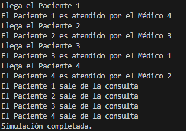

PREGUNTAS: 
¿Cuántos hilos se están ejecutando en este programa? Explica tu respuesta. 

Se estan ejecutando 5 hilos, uno principal y 4 para los pacientes

¿Cuál de los pacientes entra primero en consulta? Explica tu respuesta.

El primer paciente, ya que es el primero en llegar a la consulta, esto variaria si fuese de manera random

¿Cuál de los pacientes sale primero de consulta? Explica tu respuesta.

El paciente 1, ya que tarda 10 segundos y mientras los otros pacientes estan siendo atendidos o estan llegando, este ya ha avanzado en su consulta por lo que sale antes.

