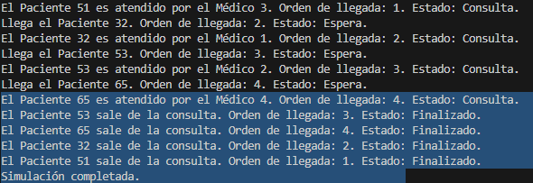
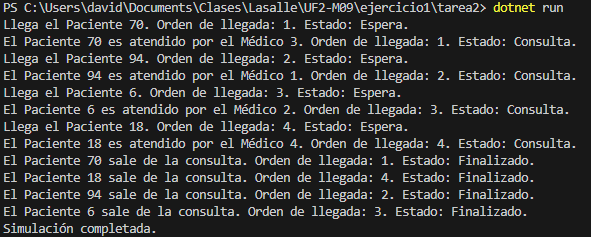

¿Cuál de los pacientes sale primero de consulta? Explica tu respuesta.

Ahora el paciente que sale ultimo de la consulta es aleatorio, aunque si que es verdad que suele salir el primero en llegar, pero al tener un tiempo aleatorio, un paciente que entra despues que el primer paciente, si su tiempo de espera es menor a x-2, entonces saldra antes de la consulta.

Como nota, se usaron 4 pacientes, pero se pueden aumentar a mas con simples modificaicones de codigo sin embargo en el enunciado no lo ponia. Lo mismo pasa con los doctores, estos se pueden aumentar o disminuir para hacer mas pruebas.

