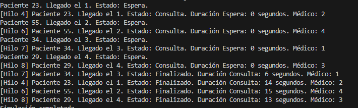

Pregunta:
¿Has decidido visualizar información adicional a la planteada en el ejercicio? ¿Por qué? Plantea qué otra información podría ser útil visualizar.

El numero del hilo realizado, ademas del medico que le atiende. Podria ser util tambien, ver el inicio y final en tiempo real de la duracion de los hilos, o ver una media de cuanto dura cada hilo para optimizar estos.

