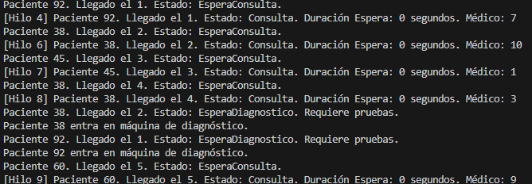
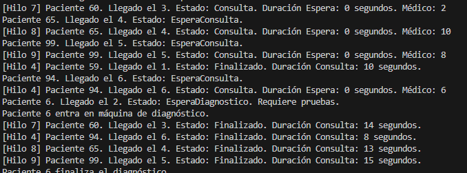

¿Los pacientes que deben esperar para hacerse las pruebas diagnostico entran luego a hacerse las pruebas por orden de llegada? Explica que tipo de pruebas has realizado para comprobar este comportamiento. 

No, no necesariamente entran por orden de llegada, ya que este depende de cuando terminan su consulta y consigue una maquina disponible.
Se realizaron varias pruebas de como funciona el programa, y en muchos casos, pacientes con número de llegada mayor entraron antes que otros que estaban esperando más tiempo

