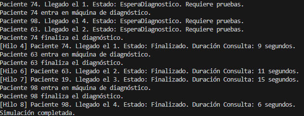
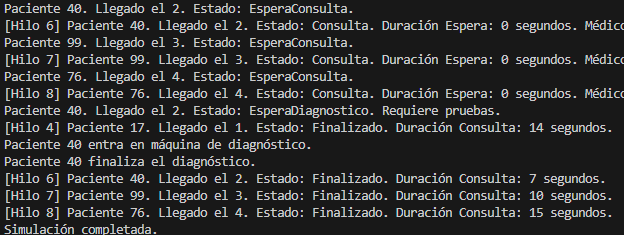

Pregunta:
Explica la solución planteada en tu código y porqué las has escogido.

Se usa una variable "turnoDiagnostico" que repreenta el orden de llegada de los pacientes.Cada paciente entonces espera con el bucle while hasta que su llegada coincida con el valor actual del turno.

Si es turno del paciente este puede entrar en las dos maquinas disponibles. Si finaliza la prueba, se incrementa el turno dejando que el sigueinte paciente pase a la consulta.

Es una solucion sencilla de utilizar, sin meter metodos o soluciones extrañas, manteniendo la logica que ya teniamos del ejercicio anterior usando hilos y sin usar estructuras de datos demasiado complicadas.

Parte 2:
Plantea otra posibilidad de solución a la que has programado

Otra posible solución sería utilizar una estructura de datos como una PriorityQueue o una cola sincronizada (FIFO), donde los pacientes que requieren diagnóstico se añadan en orden de llegada tras salir de la consulta.

Luego, uno o varios hilos encargados de gestionar las máquinas de diagnóstico podrían ir atendiendo a los pacientes en el orden en que están en la cola. Este enfoque puede ser más complejo de programar, pero también más escalable, especialmente si el número de pacientes o máquinas aumentara.

