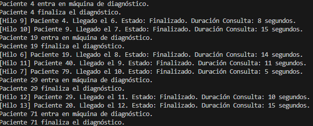
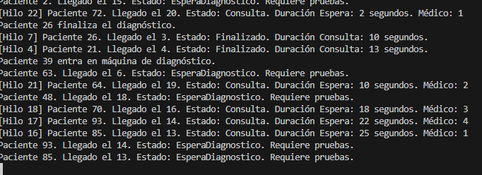
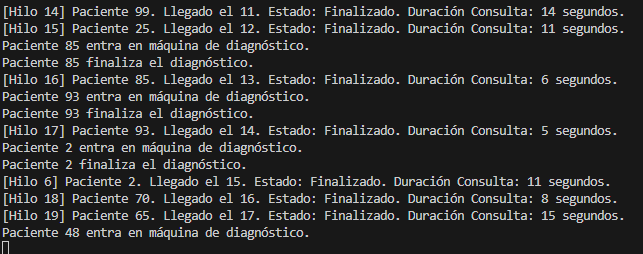

Pregunta:
Explica el planteamiento de tu código y plantea otra posibilidad de solución a la que has programado y porqué has escogido la tuya.

El codigo actual funciona bastante parecido al ejercicio anterior,donde mediantte hilos podemos controlar el orden de llegada y la prioridad de los pacientes. Es un sistema bastante simple donde cada paciente se va a signando en orden de llegada. Una posible mejora, igual que antes seria la de usar estructuras de datos algo mas complejas como pueden ser la cola de prioridades, o colas para los pacientes que esepran. De igual manera que en el eejercicio anterior se opto por una solucion algo mas sencilla, si uso de estrucutra de datos compleja.

Pregunta:
¿Los pacientes que deben esperar entran luego a la consulta por orden de llegada? Explica que tipo de pruebas has realizado para comprobar este comportamiento

Si, los pacientes han de esperar cuando llegan si no hay medicos o maquinas disponibles, es decir que si un paciente llega el 7mo, y no hay nada disponible habra de eseprar a que alguna de las maquinas se libere. Para las pruebas simplemente se ejecuto el programa varias veces, al haber 20 pacientes que llegan cada 2 segundos el sistema se satura de gente (que no quiere decir que el programa falle) y estos se asignan en orden de llegada al medioc o maquina correspondiente.

Una cosa a mencionar es como las personas que requieren diagnosticos suelen esperar mas, lo cual tiene algo de sentido al tener solo 2 maquinas.

Otro aspecto a comentar sobre los resultados es que muchas veces, parece que los pacientes llegan a la vez, esto porque el sistema los imprime casi a la vez, pero realmente la restriccion de llegar cada 2 segundos se mantiene.

fUNCIONAMIENTO:

En esta imagen el sistema se queda unos 10 segundos parado, esperando que se desocupen maquinas

En esta imagen el sistema sigue asignando maquinas.
