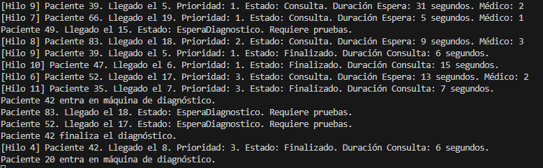
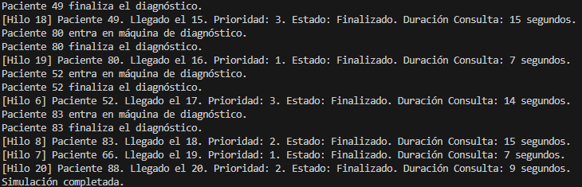

Explica el planteamiento de tu código y plantea otra posibilidad de solución a la que has programado y porqué has escogido la tuya.

Se ha planteado el codigo con la nueva modificacion que permite añadir el atributo de prioridad, manteniendo la logica de los anteriores apartados. El paciente llega, con una prioridad aleatoria, este entra en un bucle hasta que se le asigne un doctor, basandonos en la prioridad que tiene, luego si requiere diagnositco, se le asigna una de las dos maquinas disponibles. Esta solucion es rapida y sencilla sin estructura de datos complejas. Igual que en todos los ejercicios se podria mejorar usando cola de prioridades ( de hecho es donde mas sentido tiene usarla),y asi poder ordenar directamente los pacientes en esta cola en lugar de hacer un bucle iterando cada uno mirando su prioridad ( la cola de prioridad vendria ordenada ya). Este ultimo enfoque es algo mas dificl de implmentar ya que usa una estructura de datos algo compleja.

Captura que evidencia el uso de las prioridades.
