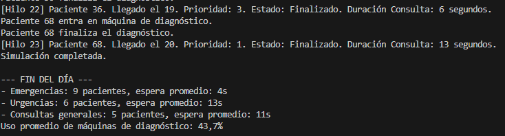
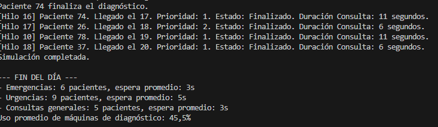

¿Puedes explicar tu código y porque has decidido hacerlo así? 
Para esta ultima parte de codigo simplemente se ha añadido codigo para calcular y mostrar estaisticas globales.
Se recorren todos los pacientes y se ordenan por oden de prioridad e imprimos cuantos fueron atentdidos.
Guardamos el tiempo medio de espera,y tambien el uso promedio de la mauqina de diagnostico.

Se implementa de manera que usemos las listas del progrmaa que ya habiamos implmentado, tambien se implementa, la propiedad de pacientes TiempoEspera para valcular luego la meida que espera. Esta manera es sencilla, simplemente vamos guardando los datos de cada paciente y luego se muestran al finalizar el progrma.

