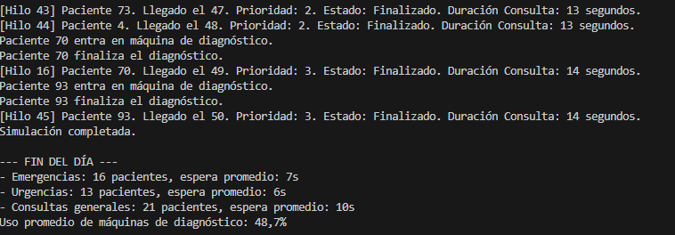
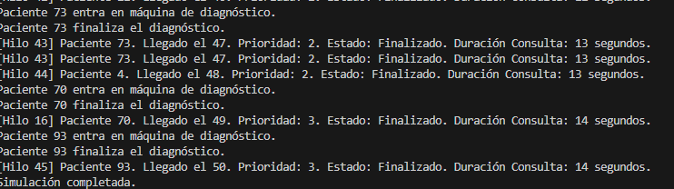

Tarea 1, ¿cumple requisitos?
Si, simula un hospital donde hay diferentes pacientes y que estos tienen un orden de llegada y una prioridad

Imagenes con 50 pacientes

Tarea 2, ¿qué comportamientos no previstos detectas?
Pues, ya se comento que, muchas veces aparenta que que en la consola los pacientes llegan uno tras otro despues de cierto tiempo, pero esto realmente no es asi, es un problema con los hilos y como se printan, pero realmente si que estan llegando cada dos segundos.
Otro problema observado es que hay veces que el sistema al haber muy pocas maquinas de diagnostico, esto hace que se formen cuellos de botella en la asiignacion de estos.
Prueba de que esto sucede, se observa como van esperando para entrar en la maquina.

Tarea 3, ¿Cómo adaptarías tu solución?

Pues haciendo que el numero de maquinas se ajuste dinamicamente al numero de pacientes necesarios, o que se pueda modificar en el codigo. Por otra parte se pueden usar estructura de datos mas complejas para hacer el codigo mejor.

